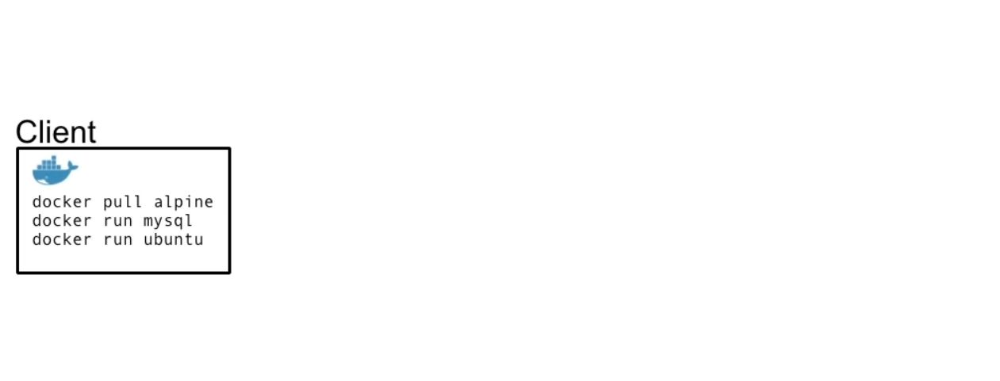
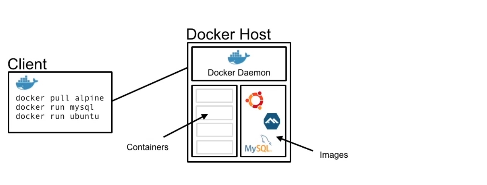
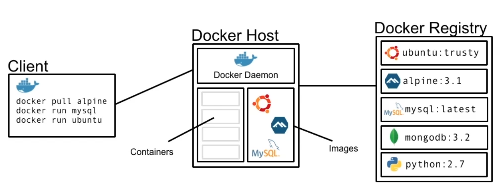
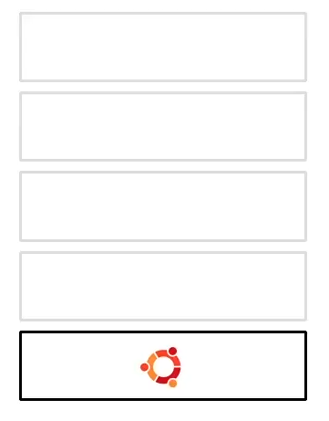
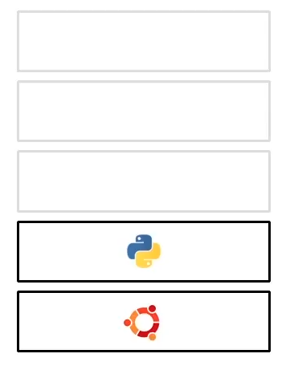
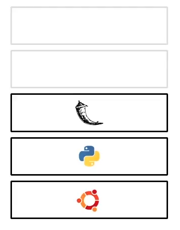
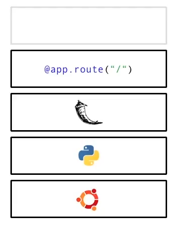
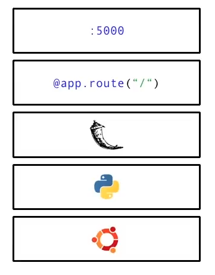
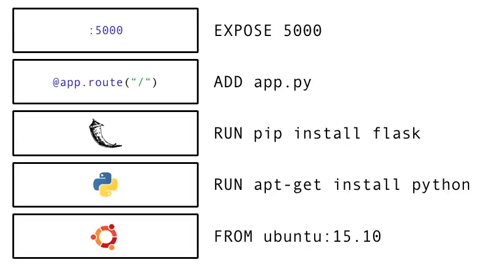
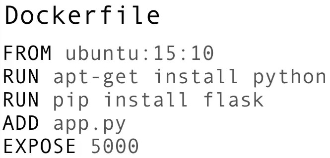

## Introduction to Docker

Ganesh Pagade  
Mar 2017

---

## Overview

1. OS Level Virtualization
1. Docker Architecture
1. Docker Setup
1. Docker Containers
1. Docker Images
1. Docker Volumes
1. Docker Networking
1. Docker Compose
1. Docker Swarm
1. Kubernetes
1. Reference Material

Note:
- Slides and other material used in this training is shared online.
  - Verbose as much as possible
- We have lots to cover. Usually a 3 full day training is conducted.

---

## About Me

- 12+ years in software engineering/architecture <!-- .element: class="fragment" data-fragment-index="1" -->
- Masters in CS from University of Pune <!-- .element: class="fragment" data-fragment-index="2" -->
- 1+ year in HPE - Cloud Optimizer <!-- .element: class="fragment" data-fragment-index="3" -->
- Interested in Distributed Computing, Microservices, Containers and DevOps <!-- .element: class="fragment" data-fragment-index="4" -->
- <!-- .element: class="fragment" data-fragment-index="5" --> [http://www.rockoder.com](http://www.rockoder.com)

---

## Virtualization

 <!-- .element: class="fragment" data-fragment-index="1" -->
 <!-- .element: class="fragment" data-fragment-index="2" -->

- Type 1: ESXi, Xen   <!-- .element: class="fragment" data-fragment-index="3" -->
- Type 2: VirtualBox, VMware Workstation <!-- .element: class="fragment" data-fragment-index="4" -->

Note:
- To better utilize hardware
- To reduce cost

---

### Virtual Machines vs Containers

 <!-- .element: class="fragment" data-fragment-index="1" -->
 <!-- .element: class="fragment" data-fragment-index="2" -->
- Container Engine  <!-- .element: class="fragment" data-fragment-index="3" -->
  - Solaris Zones, LXC, Docker, Rocket <!-- .element: class="fragment" data-fragment-index="3" -->

-----

### Virtual Machines vs Containers


- Containers + VMs = Flexibility <!-- .element: class="fragment" data-fragment-index="1" -->

-----

### Virtual Machines vs Containers

- Virtual Machines
  - Heavy, Slow Provisioning <!-- .element: class="fragment" data-fragment-index="1" -->
  - Good Isolation <!-- .element: class="fragment" data-fragment-index="2" -->
  - Can Run Different Family of OS Than Host<!-- .element: class="fragment" data-fragment-index="3" -->

----------

- Containers
  - Light, Faster Provisioning <!-- .element: class="fragment" data-fragment-index="1" -->
  - Poorer Isolation <!-- .element: class="fragment" data-fragment-index="2" -->
  - Shared Kernel, Need Same Family of OS<!-- .element: class="fragment" data-fragment-index="3" -->

---

## Docker Internals

- chroot - changes current and root directory for a process <!-- .element: class="fragment" data-fragment-index="1" -->
- namespaces - isolation of process tree, mounts, network, users, hostnames <!-- .element: class="fragment" data-fragment-index="2" -->
- cgroups - isolates and limits resources like cpu, memory etc <!-- .element: class="fragment" data-fragment-index="3" -->

- LXC - used by earlier Docker releases <!-- .element: class="fragment" data-fragment-index="4" -->
- runC - Docker replaced LXC with runC <!-- .element: class="fragment" data-fragment-index="5" -->

Note:
  - OS Level Virtualization
  - Control Groups
  - LinuX Container

---

## So What is Docker?

- Abstraction on container engine <!-- .element: class="fragment" data-fragment-index="1" -->
- Command line and HTTP API <!-- .element: class="fragment" data-fragment-index="2" -->
- Standardized packaging for app and libraries <!-- .element: class="fragment" data-fragment-index="3" -->
- Layered image format <!-- .element: class="fragment" data-fragment-index="4" -->
- Ecosystem of tools and services <!-- .element: class="fragment" data-fragment-index="5" -->
- Software container platform <!-- .element: class="fragment" data-fragment-index="6" -->

---

## Why are containers so popular?

- Dev, QA, Prod - Story of a SaaS based e-commerce portal
- No more: "It works on my machine"
- Immutable containers

---

## Docker Engine

<!-- .slide: data-transition="fade-in none-out" -->



---

## Docker Engine

<!-- .slide: data-transition="none-in fade-out" -->



---

## Docker Engine

<!-- .slide: data-transition="none-in fade-out" -->



---

## Docker Installation

```bash
$ sudo apt-get update
$ sudo apt-get install linux-image-extra-$(uname -r) \
    linux-image-extra-virtual
$ sudo apt-get install apt-transport-https \
    ca-certificates curl software-properties-common
$ curl -fsSL https://download.docker.com/linux/ubuntu/gpg |
    sudo apt-key add -
$ sudo apt-key fingerprint 0EBFCD88
$ sudo add-apt-repository \
   "deb [arch=amd64] https://download.docker.com/linux/ubuntu \
   $(lsb_release -cs) stable"
$ sudo apt-get update
$ sudo apt-get install docker-ce
```
- [Ubuntu Installation](https://docs.docker.com/engine/installation/linux/ubuntu/)

Note:
- If required, set http_proxy and https_proxy in /etc/environment file. Ex:
  - export http_proxy=http://web-proxy.in.hpecorp.net:8080
  - export https_proxy=https://web-proxy.in.hpecorp.net:8080
  - CE - Community Edition

-----

## Additonal Configuration

```bash
$ sudo groupadd docker
$ sudo usermod -aG docker $USER
```

- [Post install configuration](https://docs.docker.com/engine/installation/linux/linux-postinstall)

-----

## Docker Hub

- Central repository for image discovery, distribution and change management <!-- .element: class="fragment" data-fragment-index="1" -->
- <!-- .element: class="fragment" data-fragment-index="2" --> Public: [hub.docker.com](hub.docker.com)
- <!-- .element: class="fragment" data-fragment-index="3" --> Private: [hub.docker.hpecorp.net](hub.docker.hpecorp.net)

---

## Demo - First Container

```bash
$ docker run alpine pwd
$ docker run -it alpine /bin/sh
    $ hostname
    $ ps -ef
    $ ls -l
$ docker ps
$ docker ps -a
$ docker rm <container id>/<container name>
$ docker images
$ docker rmi <image id>/<image name>
```

Note:
- run command pulls the image if it is not locally present
- container pwd output is different than the host pwd
  - container has the own isolated view of the OS
- this is a short lived container only to execute pwd command
- to go inside the container use -i (interactive) -t (terminal)

-----

## Demo - Daemon Container

```bash
$ docker run ubuntu
$ docker run ubuntu ls
$ docker run ubuntu ls -l
$ docker run training/webapp
$ docker run -p 80:5000 training/webapp
$ docker run -d -p 80:5000 training/webapp
$ docker ps
$ docker logs <container id>
$ docker stop <container id>
$ docker run -d --name webapp -p 80:5000 training/webapp
$ docker restart <container id>
```

Note:
- `-d` - long running containers in detach mode
- `-p` to map host port to the container port
- `-P` randomly map host ports to the container ports
  - to get the ports used:
    - `docker ps -l` - last run container
    - `docker port <container id>`
- containers use name to communicate

-----

## Demo - Configuration

```bash
$ docker run -e "STR1=HI" -e "STR2=BYE" ubuntu /bin/bash -c export
```

Note:
- Pass the configuration at launch time as environment variables

-----

## Demo - Container Lifecycle

```bash
$ docker run --name webapp training/webapp
$ docker ps
$ docker ps -a
$ docker restart webapp
$ docker stop webapp
$ docker stop --time 10 webapp
$ docker kill webapp
$ docker rm webapp
$ docker ps -a
$ docker rm -f webapp
$ docker rm -f `docker ps -qa`
```

Note:
- restart - runs the container in detached mode
- stop - send SIGTERM followed by SIGKILL signal
  - SIGKILL happens if container fails to terminate gracefully
  - time - seconds to wait before sending SIGKILL
    - should be sufficient enough for container to gracefully shutdown (resource cleanup etc)
- rm - cannot be undone

-----

## Demo - Debugging

```bash
$ docker run -d -P --name redis redis
$ docker logs redis
$ docker logs -f redis
$ docker inspect redis
$ docker exec -ti redis /bin/bash
  $ ps -ef
$ docker exec -ti redis ps -ef
```

Note:
- inspect - to get local ip of the container
- Redis container is running redis as primary process.
  - use `exec` to run the bash in the already container as a secondary process

---

## Docker Images

- Using pre-built images is very useful <!-- .element: class="fragment" data-fragment-index="1" -->
- You can also create your own images <!-- .element: class="fragment" data-fragment-index="2" -->
- Create your own images based on pre-built images <!-- .element: class="fragment" data-fragment-index="3" -->
- Distribute them as easily as pre-built images <!-- .element: class="fragment" data-fragment-index="4" -->
- Makes the application/product highly portable <!-- .element: class="fragment" data-fragment-index="5" -->

---

## Docker Images

<!-- .slide: data-transition="fade-in none-out" -->


Note:
- To run on Linux needs to have Linux libraries and binaries
  - Cannot run Windows base OS on Linux host
- Falvor of Linux we pick, decide which libraries we can use
- Base image - Ubuntu - this is pre-built image

---

## Docker Images

<!-- .slide: data-transition="none-in fade-out" -->



Note:
- install python

---

## Docker Images

<!-- .slide: data-transition="none-in fade-out" -->



Note:
- Flask - Python based web framework

---

## Docker Images

<!-- .slide: data-transition="none-in fade-out" -->



Note:
- Add your app code

---

## Docker Images

<!-- .slide: data-transition="none-in fade-out" -->


Note:
- Explicitly expose ports that needs to be available outside the contianer

---

## Docker Images

<!-- .slide: data-transition="none-in fade-out" -->



Note:
- Docker images are built from layers
- Layers are immutable
- Can't change them but create new once
- Can go back to any point and diverge
- We reuse layers that dont change
- Can name and tag any layer

-----

## Docker Images

- Run Container - Change State - Save State <!-- .element: class="fragment" data-fragment-index="1" -->
- Layer: Only difference is saved <!-- .element: class="fragment" data-fragment-index="2" -->
- Two ways to create: <!-- .element: class="fragment" data-fragment-index="3" -->
  - Manual <!-- .element: class="fragment" data-fragment-index="4" -->
  - Dockerfile <!-- .element: class="fragment" data-fragment-index="5" -->

Note:
- Images are created by running containers, changing their state and then saving the new state to disk
- When the new state is saved, only the difference introduced is saved forming layers
- Two ways to create images
  - Make changes to a running container and save the state to disk
  - Use Dockerfile
    - It lists instructions to be performed on the image to produce new layer

-----

## Docker Images

<!-- .slide: data-transition="none-in fade-out" -->


Note:
- FROM, RUN are Docker instructions

-----

## Docker Images

<!-- .slide: data-transition="none-in fade-out" -->


Note:
- We can put this file in version control
- Use it to create automated builds

-----

## Demo - Docker Hub

[hub.docker.com](hub.docker.com) <!-- .element: class="fragment" data-fragment-index="1" -->

```bash
$ docker pull rabbitmq
$ docker pull rabbitmq:3.6-management
$ docker run -d -p 15672:15672 rabbitmq:3.6-management
```
<!-- .element: class="fragment" data-fragment-index="2" -->

Note:
- rabbitmq
  - public contributed, prefixed with user/org name
  - official, follows best practises - preferred
  - tags - kind of version
    - latest - default tag

-----

## Demo - Docker Image

```bash
$ docker search alpine
$ docker images
$ docker pull alpine
$ docker images
```

-----

## Demo - Dockerfile

```Dockerfile
FROM alpine
```
<!-- .element: class="fragment" data-fragment-index="1" --> 

```Dockerfile
MAINTAINER rickfast <rick.t.fast@gmail.com>
```
<!-- .element: class="fragment" data-fragment-index="2" -->

```Dockerfile
RUN apk update && apk add nodejs
```
<!-- .element: class="fragment" data-fragment-index="3" -->

```Dockerfile
RUN mkdir average
```
<!-- .element: class="fragment" data-fragment-index="4" -->

```Dockerfile
ADD average.js average/
```
<!-- .element: class="fragment" data-fragment-index="5" -->

```Dockerfile
WORKDIR average
```
<!-- .element: class="fragment" data-fragment-index="6" -->

```Dockerfile
ENTRYPOINT ["node","average.js"]
```
<!-- .element: class="fragment" data-fragment-index="7" -->

Note:
- Dockerfile specifies list of instructions to build Docker image
- Sharable, Reprocible and Automatable Process
- Entrypoint defines the main process that will be run within the container
  - this is the pid 1

-----

## Demo - Application

```Javascript
var sum = 0;
var count = 0;
process.argv.forEach(function (val, index, array) {
  if(index > 1) {
    sum += parseInt(val);
    count ++;
  }
});
console.log(sum / count);
```

-----

## Demo - Build Docker Image

```bash
$ wget rockoder.github.io/introduction_to_docker/demo_files/ex1_images/average.js
$ wget rockoder.github.io/introduction_to_docker/demo_files/ex1_images/Dockerfile
$ docker build -t rockoder/average .
$ docker run rockoder/average 2 3 4
```

Note:
- ensure you are in a clean empty directory to fire wget
- `docker build` creates container from base images
- and executes instruction in the container and saves to a image layer
- Each line in Dockerfile is automic commit
- No need to mention the Entrypoint process in the docker run command

-----

## Demo - Push Docker Image

```bash
$ docker tag <image id> <dockerhub account name>/average:1.0
$ docker tag <image id> <dockerhub account name>/average:latest
$ docker images
$ docker login
$ docker push <dockerhub account name>/average
```

```bash
$ docker login https://hub.docker.hpecorp.net
```
<!-- .element: class="fragment" data-fragment-index="1" -->

Note:
- Same image can have multiple tags
- Push and check on hub.docker.com

---

## Docker Networking


Note:
- An app can consist of multiple containers like web server, cache, db etc
- These containers need to run on the same network to interact with each other
- They way containers are isolated, networks can also be isolated

-----

## Docker Networking

```bash
$ docker network ls
$ ifconfig
$ docker run -d -P --name default-network training/webapp
  $ ifconfig
$ docker run -d -P --net none --name no-network training/webapp
  $ ifconfig
$ docker run -d -P --net host --name host-network training/webapp
  $ ifconfig
```

Note:
- Docker by default runs three networks on the host
- default is bridge

-----

## Docker Networking

```bash
$ docker network create --driver bridge my-network
$ docker network ls
$ docker run -d --net my-network --name webapp training/webapp
$ docker run alpine wget -qO- webapp:5000
$ docker run --net my-network alpine wget -qO- webapp:5000
```
---

## Docker Volumes

- Stateless services <!-- .element: class="fragment" data-fragment-index="1" -->
  - Don't save any persistent state <!-- .element: class="fragment" data-fragment-index="2" -->
  - Remain portable and scalable <!-- .element: class="fragment" data-fragment-index="3" -->
- Persistent state cannot be stored within container <!-- .element: class="fragment" data-fragment-index="4" -->
  - Containers will come and go <!-- .element: class="fragment" data-fragment-index="5" -->
- Data volumes are directories to store persistent data <!-- .element: class="fragment" data-fragment-index="6" -->

-----

## Docker Volumes

```bash
$ docker run -d -p 5984:5984 \
  -v $(pwd)/data:/usr/local/var/lib/couchdb \
  --name couchdb klaemo/couchdb:1.6
$ curl -X PUT http://localhost:5984/db
$ ls data/
$ curl -H 'Content-Type: application/json' \
  -X POST http://localhost:5984/db \
  -d '{"value":"Hello Docker World!"}'
$ curl http://localhost:5984/db/<id>
$ docker rm -f <couchdb container id>
$ docker run -d -p 5984:5984 \
  -v $(pwd)/data:/usr/local/var/lib/couchdb 
  --name couchdb_new klaemo/couchdb:1.6
$ curl http://localhost:5984/db/<id>
```

Note:
- couchdb state is stored in external directory data/
- Even if we remove the couchdb container the data will remain
- Which can be used by the new couchdb container

---

## Docker Compose

- Another tool in the Docker ecosystem <!-- .element: class="fragment" data-fragment-index="6" -->
- Helps in container orchestration <!-- .element: class="fragment" data-fragment-index="6" -->
- Document defining containers and their relationships <!-- .element: class="fragment" data-fragment-index="6" -->

Note:
- Helps in running the containers in correct order

---

### Docker Compose - Installation

```bash
$ sudo -i
$ curl -L "https://github.com/docker/compose/releases/download/1.11.2/docker-compose-$(uname -s)-$(uname -m)" \
  -o /usr/local/bin/docker-compose
$ chmod +x /usr/local/bin/docker-compose
$ exit
$ docker-compose --version
```

[Docker Compose Installation](https://docs.docker.com/compose/install/)

---

## Docker Compose

```yaml
version: "2"
services:
  kv-store-1:
    image: redis
  kv-store-2:
    image: redis
```

Note:
- Docker Compose yaml specification version 2
- services - list of containers
- kv-store-1 - container name
- attributes - options of the docker run command

---

## Docker Compose

```bash
$ wget rockoder.github.io/introduction_to_docker/demo_files/ex2_compose/docker-compose.yml
$ docker-compose up
$ docker-compose up -d
$ docker-compose stop
$ docker-compose rm
```

Note:
- Notices the container name at each log line.
- Helpful when we run multiple containers
- `-d` for detached mode. Will restart the stopped containers

---

## Docker Compose - ELK Stack


---

## Reference Material
